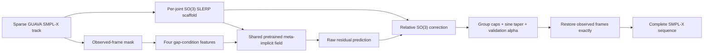

# GUAVA Mask-Aware Meta-Implicit Frame Completion

Date: 2026-07-19  
Status: full experiment history archived; deployable selection remains alpha 0 (exact SO(3) SLERP)

> **Standalone extraction note:** Sections 1-19 record the chronological
> experiments, including older dense-SOKE pseudo-target variants. Section 20
> is the latest retained-GUAVA-only method. Its alpha-1 diagnostic did not pass
> the deployment gate, so the accepted current output is still the SLERP
> scaffold. Code and artifact paths in this copy refer to
> `/media/cvpr/haomian/SignMotionRefinement`.

## 1. Executive Summary

The frame-completion pipeline used for the sparse GUAVA SMPL-X tracks is:

```text
sparse GUAVA poses and observed-frame mask
  -> per-joint SO(3) SLERP scaffold
  -> shared pretrained meta-implicit residual field
  -> mask/gap-conditioned bounded SO(3) corrections
  -> restore every observed frame exactly
  -> complete SMPL-X sequence
```

The important design choice is that SLERP is the safe scaffold, while the neural field only predicts a bounded correction inside missing intervals. The model is a single shared, amortized residual field initialized from the existing soft-reconstruction checkpoint. It is not a new SIREN optimized separately for each sequence, and it does not perform per-sequence latent optimization at inference time.

No conversion to the general Flow training format described in `docs/reference_flow_training_dataset_format.md` was required. The fine-tuning code consumes the existing GUAVA completion NPZ files and aligned dense SOKE pose directories directly.

The first mask-aware checkpoint reduced untouched-pilot missing-frame root-relative whole-body MPJPE from **144.343 mm with SLERP** to **130.493 mm**, but its predicted FK-jerk mean was 496.905 m/s³. The improved C2/FK-temporal checkpoint obtains **134.849 mm MPJPE** and reduces jerk mean to **403.447 m/s³** and jerk p95 from **2,404.099 to 1,831.165 m/s³**. Relative to v1, this is an 18.8% mean-jerk and 23.8% p95-jerk reduction for a 3.34% MPJPE increase. It remains 6.58% more accurate than SLERP, and all observed frames remain exactly unchanged.

> **Reference warning:** the dense SOKE pose tracks used as targets and for evaluation are model-generated pseudo-references. They are not motion-capture ground truth.

---

## 2. Problem Definition and Terminology

The input GUAVA tracking data contains motion sequences in which low-confidence frames were discarded. Each completed sequence therefore has:

- an SMPL-X pose for every timeline position after scaffold construction;
- an `observed_mask` identifying the frames retained by GUAVA;
- missing runs between two observed anchors;
- sometimes leading or trailing missing runs with only one usable anchor.

This document uses the following terms:

| Term | Meaning |
|---|---|
| Observed frame | A frame retained by GUAVA; it must never be changed by completion. |
| Missing frame | A frame discarded by GUAVA because of low confidence. |
| Bracketed gap | A missing run with an observed frame on both its left and right sides. |
| Unbracketed gap | A leading or trailing missing run with no anchor on one side. |
| SLERP scaffold | Per-joint spherical interpolation on SO(3), with linear expression interpolation. |
| Dense SOKE reference | A frame-aligned pseudo-target from the dense SOKE fitting track. |
| Mask-aware residual | The learned correction applied only inside bracketed gaps. |

SLERP is not ordinary linear interpolation of axis-angle values. For each joint, it follows the shortest valid path between two rotations on SO(3). It is the baseline and the fallback of this pipeline.

---

## 3. End-to-End Pipeline



For a sequence with scaffold \(s(t)\), the shared field first produces a raw prediction:

$$
x_{\mathrm{raw}}(t)
=
s(t) + D_\theta\!\left(\tau(t),s(t),\Delta s(t),\Delta^2s(t),z,c_{\mathrm{gap}}(t)\right),
$$

where:

- \(\tau(t)\) is normalized sequence time with Fourier features;
- \(z\) is a sequence-level context code inferred from the scaffold and a blank text embedding;
- \(c_{\mathrm{gap}}(t)\) describes the missing interval containing frame \(t\);
- \(D_\theta\) is the shared sinusoidal meta-implicit decoder.

The raw output is not accepted directly. A relative rotation is computed against the SLERP scaffold, clipped, tapered, and mapped back through SO(3). This makes the neural model a conservative corrector rather than an unconstrained replacement for the scaffold.

---

## 4. Data Preparation

### 4.1 Input Sources

The fine-tuning run used:

| Role | Location |
|---|---|
| Original tracked dataset | `/media/cvpr/haomian/data/SOKE_FLOW/how2sign_soke_upper_smplx_GUAVA/guava_tracked` |
| SO(3) SLERP completions | `/media/cvpr/haomian/data/SOKE_FLOW/how2sign_soke_upper_smplx_GUAVA/guava_completed_flow` |
| Dense SOKE pseudo-targets | `/media/cvpr/haomian/data/SOKE/How2Sign/{split}/poses/{sequence}` |
| Fine-tuning cache | `/media/cvpr/haomian/data/SOKE_FLOW/how2sign_soke_upper_smplx_GUAVA/guava_mask_aware_meta_cache_v1` |

The first completion stage converts the irregular tracked data into frame-aligned NPZ sequences. Each completion contains compact rot6D pose features and the original `observed_mask`. The mask-aware trainer then pairs each completion with the equally sized dense SOKE pose directory.

The compact vector has 256 values per frame:

- 41 rotations x 6 rot6D values = 246 values;
- 10 expression coefficients;
- total = 256 values.

The 41 rotations are grouped as 10 body rotations, 30 hand rotations, and 1 jaw rotation for bounding and reporting.

### 4.2 Why No General Flow-Format Refactor Was Needed

The Flow training-format document is useful for general dataset ingestion, but this task already had the two pieces required by the fitting pipeline:

1. frame-aligned compact SMPL-X sequences; and
2. an observed/missing mask for every sequence.

The dedicated cache builder in the fine-tuning trainer reads those sources directly and stores:

- `scaffold`: SLERP-completed compact rot6D sequence;
- `target`: dense SOKE compact rot6D pseudo-target;
- `observed_mask`;
- `eligible_mask`;
- `condition`: four gap-condition channels;
- frame counts and source-path metadata.

Consequently, converting the dataset into another generic layout would have added an extra representation change without providing information needed by this experiment.

### 4.3 Eligible Frames

Supervision is restricted to missing frames inside bracketed gaps. The following frames receive no target loss:

- observed GUAVA frames;
- padding frames;
- leading missing runs;
- trailing missing runs.

Unbracketed leading and trailing frames keep the endpoint-held SLERP result because two-sided interpolation is impossible. In the final pilot, 550 missing frames were bracketed and received neural corrections, while 316 leading or trailing missing frames retained the endpoint-held scaffold.

---

## 5. Leakage-Controlled Split

How2Sign sentence segments from the same source video can be strongly correlated. Splitting individual clips randomly would therefore leak source-video motion and appearance across training, validation, and pilot evaluation.

The split key is the canonical first 11 characters of the How2Sign/YouTube source ID. This matters because some sentence suffixes contain additional underscores and cannot safely be parsed from the right.

The procedure was:

1. collect all 12 source-video IDs represented in the pilot;
2. exclude those source groups before building the fine-tuning candidates;
3. discard candidates containing no bracketed missing frames;
4. create a deterministic group-disjoint train/internal-validation split from the remaining source groups;
5. keep the 12 pilot clips untouched until final evaluation.

The resulting split was:

| Partition | Clips | Source-video groups | Eligible bracketed missing frames |
|---|---:|---:|---:|
| Train | 96 | 9 | 4,034 |
| Internal validation | 26 | 2 | 541 |
| Untouched pilot | 12 | 12 excluded source groups | 550 corrected frames |

The initial GUAVA training pool contained 187 clips from 15 canonical source groups. Four of the 12 pilot groups overlapped that pool, removing 60 clips. Of the 127 remaining candidates, five contained no bracketed gap, leaving the 122 train/validation clips above.

The exact split and every source path are recorded in:

`artifacts/experiments/guava_mask_aware_meta_finetune/data_manifest.json`

---

## 6. SLERP Scaffold

For a bracketed gap of length \(L\), let \(R_L\) and \(R_R\) be the observed rotations immediately before and after the gap. Each joint is interpolated independently:

$$
R_{\mathrm{slerp}}(k)
=
R_L\,\operatorname{Exp}\!\left(
\frac{k}{L+1}\operatorname{Log}(R_L^\top R_R)
\right),
\qquad k=1,\ldots,L.
$$

This produces a valid rotation at every missing frame and exactly matches both observed anchors. Expression coefficients use ordinary interpolation. Leading and trailing gaps use endpoint holding.

The scaffold is intentionally kept as a complete fallback. When correction strength \(\alpha=0\), the mask-aware pipeline exactly reduces to SLERP.

---

## 7. Mask- and Gap-Aware Conditioning

The parent residual field did not know which frames were observed, which were missing, or where a frame lay inside a gap. That made frozen transfer weak: the model could not distinguish a reliable anchor from a discarded frame.

For a bracketed missing run of length \(L\), define the phase for its \(k\)-th missing frame as:

$$
u_k = \frac{k}{L+1}.
$$

Four features are added at every frame:

| Channel | Definition | Purpose |
|---|---|---|
| Sine envelope | \(\sin(\pi u_k)\) | Tapers the correction toward both anchors. |
| Left phase | \(u_k\) | Gives normalized distance from the left anchor. |
| Right phase | \(1-u_k\) | Gives normalized distance from the right anchor. |
| Gap length | \(\min(\log(1+L)/\log(257),1)\) | Identifies the scale of the missing interval. |

All four channels are zero on:

- observed frames;
- padding;
- leading unbracketed gaps;
- trailing unbracketed gaps.

The first channel is also used as the output correction envelope. It is exactly zero at the conceptual anchor endpoints and small near them, which reduces discontinuities at the observed/missing boundaries. The observed frames are additionally restored after inference, providing an explicit exactness guarantee.

Implementation: `src/sign_motion_refinement/pipeline/gap.py`

---

## 8. Model Initialization and Architecture

### 8.1 Parent Checkpoint

The model was initialized from:

`artifacts/experiments/smpl_samples_meta_implicit_soft_recon_stride8_fk_smooth/checkpoints/best.pt`

The parent checkpoint is a pretrained shared meta-implicit soft-reconstruction residual field. It is not the poor per-clip SIREN fitting experiment. The parent was saved at epoch 100 and used no test-time latent adaptation (`inner_steps: 0`).

### 8.2 Decoder Inputs

The original first implicit layer had 917 inputs:

| Feature | Width |
|---|---:|
| Normalized scalar time + 10 Fourier bands | 21 |
| SLERP scaffold pose | 256 |
| Scaffold velocity | 256 |
| Scaffold acceleration | 256 |
| Sequence context code | 128 |
| Original total | **917** |
| New gap-condition channels | **4** |
| Mask-aware total | **921** |

The decoder uses four 256-wide sine layers followed by normalization and a 256-dimensional residual output. The 128-dimensional sequence code is predicted from scaffold mean, standard deviation, first frame, last frame, and text context.

GUAVA completion files do not provide aligned language for this fitting task. Every sequence therefore receives the same cached blank-text FLAN-T5 embedding. The text projection is frozen; the scaffold-context and implicit decoder parameters are fine-tuned. This makes the learned correction depend on motion and gap geometry rather than clip-specific target information.

### 8.3 Safe Weight Transplant

All compatible parameters are copied exactly from the parent checkpoint. The first sine layer is widened from 917 to 921 columns, and the four new columns are initialized to zero.

Therefore, before fine-tuning, the new model has exactly the same behavior as the parent for the same scaffold. Gap conditioning only begins to affect predictions after its weights are learned.

The current inference path uses one forward pass through this shared field. It does not optimize a latent code or train a fresh model for each test sequence.

Implementation: `src/sign_motion_refinement/models/meta_implicit.py`

---

## 9. Bounded SO(3) Correction

Adding axis-angle or rot6D values linearly can produce invalid or unintuitive rotations. The pipeline instead interprets the model output as a relative rotation around the SLERP scaffold.

For each joint and frame:

1. convert scaffold and raw predicted rot6D values to rotation matrices, \(R_s\) and \(R_{\mathrm{raw}}\);
2. compute the relative correction \(R_{\mathrm{rel}}=R_s^\top R_{\mathrm{raw}}\);
3. map \(R_{\mathrm{rel}}\) to an axis-angle tangent vector with the SO(3) logarithm;
4. clip its angle using a body-, hand-, or jaw-specific cap;
5. multiply by the gap envelope and global correction strength \(\alpha\);
6. map the correction back with the SO(3) exponential and apply it to the scaffold;
7. clip expression deltas separately;
8. restore observed frames exactly in both rot6D and axis-angle representations.

In compact form:

$$
\delta = \operatorname{Log}(R_s^\top R_{\mathrm{raw}}),
$$

$$
\bar\delta(t)
=
\alpha\,e(t)\,
\operatorname{clip}_{\|\cdot\|\leq b_j}(\delta(t)),
$$

$$
R_{\mathrm{final}}(t)
=
R_s(t)\operatorname{Exp}(\bar\delta(t)).
$$

Here \(e(t)\) is the sine gap envelope and \(b_j\) is the cap for the joint group.

### 9.1 Training-Only Bound Calibration

Bounds were calibrated from the 90th percentile of scaffold-to-target residuals on eligible **training frames only**, then limited by fixed safety ceilings:

| Group | Raw train p90 | Safety ceiling | Applied hard cap | Effective cap at \(\alpha=0.75\) |
|---|---:|---:|---:|---:|
| Body | 29.422 degrees | 30 degrees | 29.422 degrees | 22.066 degrees |
| Hands | about 58.516 degrees | 45 degrees | 45 degrees | 33.750 degrees |
| Jaw | 7.762 degrees | 8 degrees | 7.762 degrees | 5.821 degrees |
| Expression | 1.210 | 1.0 | 1.0 | 0.75 |

The sine envelope reduces these limits further near gap boundaries. The largest corrections actually observed on the pilot were 12.901 degrees for the body, 33.750 degrees for the hands, 3.804 degrees for the jaw, and 0.255 for expression.

Calibrated bounds: `artifacts/experiments/guava_mask_aware_meta_finetune/bounds.json`

---

## 10. Fine-Tuning Objective

The loss is evaluated after applying the exact bounded SO(3) transformation used at inference. It is computed only on eligible bracketed missing frames, except that finite-difference windows are included when they touch an eligible frame and all frames in the window are valid.

The configured objective was:

$$
\begin{aligned}
\mathcal L ={}&
1.00\,\mathcal L_{\mathrm{rot6D}}
+0.10\,\mathcal L_{\mathrm{geo}}
+0.25\,\mathcal L_{\mathrm{expr}}\\
&+10.00\,\mathcal L_{\mathrm{FK\text{-}MPJPE}}
+0.10\,\mathcal L_{\mathrm{velocity}}
+0.02\,\mathcal L_{\mathrm{acceleration}}
+0.02\,\mathcal L_{\mathrm{correction}}.
\end{aligned}
$$

| Loss | Meaning |
|---|---|
| rot6D | Hand-weighted compact feature L1; hand features have weight 2. |
| Geodesic | Angular SO(3) distance between predicted and pseudo-target rotations. |
| Expression | L1 distance on the 10 expression coefficients. |
| FK-MPJPE | Differentiable root-relative SMPL-X whole-body joint-position error. |
| Velocity | First finite-difference matching in compact pose-feature space. |
| Acceleration | Second finite-difference matching in compact pose-feature space. |
| Correction | Small regularizer keeping the bounded output near the SLERP scaffold. |

Two limitations of this objective are important:

1. velocity and acceleration are supervised in compact pose-feature space, not directly on FK joint trajectories;
2. there is no third-order or jerk loss.

These limitations explain why positional reconstruction improved while the final jerk-vector metric regressed.

---

## 11. Optimization and Model Selection

The training configuration was:

| Setting | Value |
|---|---:|
| Random seed | 20260715 |
| Optimizer | AdamW |
| Learning rate | 2e-5 |
| Weight decay | 1e-4 |
| Batch size | 2 full-length padded sequences |
| Gradient clipping | 1.0 |
| LR schedule | Cosine decay |
| Epochs | 20 |
| Early-stop patience | 8 |
| Random cropping | None |
| Best checkpoint | Epoch 16 |

Every epoch was evaluated on the internal validation split with:

$$
\alpha \in \{0,0.25,0.5,0.75,1.0\}.
$$

Because \(\alpha=0\) is exactly the SLERP scaffold, the model-selection process always includes the safe baseline. The best checkpoint is selected by missing-frame root-relative whole-body MPJPE after choosing the best validation alpha.

At epoch 16, internal validation produced:

| Alpha | Whole-body MPJPE |
|---:|---:|
| 0.00, exact SLERP | 87.339 mm |
| 0.25 | 76.480 mm |
| 0.50 | 68.432 mm |
| **0.75** | **64.501 mm** |
| 1.00 | 65.231 mm |

The selected \(\alpha=0.75\) improved internal-validation MPJPE by 26.148% relative to SLERP. It was then frozen inside the checkpoint. No parameter, bound, alpha, or threshold was tuned on the final pilot.

Training configuration: `configs/guava_mask_aware_meta_finetune.yaml`

Trainer: `src/sign_motion_refinement/cli/train_mask_aware.py`

Best checkpoint: `artifacts/experiments/guava_mask_aware_meta_finetune/checkpoints/best.pt`

---

## 12. Untouched Pilot Results

The pilot contains 12 clips, 2,455 total frames, 1,589 observed frames, and 866 missing frames.

### 12.1 Positional Reconstruction

The primary metric is missing-frame root-relative whole-body FK MPJPE against the dense SOKE pseudo-reference.

| Method | MPJPE | Change vs. SLERP |
|---|---:|---:|
| Per-joint SO(3) SLERP | 144.343 mm | baseline |
| Frozen soft-reconstruction field | 145.249 mm | 0.628% worse |
| **Mask-aware fine-tuned field** | **130.493 mm** | **9.595% better** |

The mask-aware model also improved by 10.159% relative to the frozen field. It improved 10 of 12 clips; the two regressions were small, approximately 0.04% and 0.23%.

The result by bracketed-gap length was:

| Gap length | SLERP MPJPE | Mask-aware MPJPE | Relative change |
|---|---:|---:|---:|
| 1-2 frames | 84.082 mm | 52.717 mm | 37.303% better |
| 3-7 frames | 90.492 mm | 68.240 mm | 24.590% better |
| 8-16 frames | 76.065 mm | 55.887 mm | 26.528% better |
| 17+ frames | 170.137 mm | 161.172 mm | 5.269% better |

The smaller gain for 17+ frame gaps is expected: a long missing interval is weakly constrained by only two distant observed anchors and a sequence-level scaffold context.

### 12.2 Exact Observed-Frame Preservation

After prediction, observed frames are copied directly from the scaffold in both compact rot6D and compact axis-angle formats. The recorded maximum observed-frame deviation on the pilot is zero in both representations.

This is a hard inference invariant, not only a learned loss preference.

---

## 13. Temporal and Jerk Results

The temporal evaluation uses root-relative whole-body FK joints and native sequence FPS. Jerk is the third finite difference scaled by \(\mathrm{FPS}^3\).

| Method | Velocity-vector error | Jerk-vector error | Predicted jerk magnitude | Pseudo-reference jerk magnitude |
|---|---:|---:|---:|---:|
| SLERP | **0.480** | **816.445** | 135.821 | 816.167 |
| Frozen field | 0.552 | 927.312 | 351.230 | 816.167 |
| Mask-aware fine-tuned | 0.641 | 1,053.712 | 496.905 | 816.167 |

These numbers need careful interpretation:

- SLERP is very smooth and substantially underestimates the amount of high-frequency motion, which is why its predicted jerk magnitude is much lower than the pseudo-reference;
- the fine-tuned model recovers more motion and moves jerk magnitude closer to the pseudo-reference;
- nevertheless, its recovered changes do not match the pseudo-reference timing and direction well enough, so vector velocity and jerk errors become worse;
- the sine envelope controls correction amplitude but does not explicitly match derivatives at both anchors.

The correct conclusion is therefore:

> The checkpoint passes the positional acceptance criterion, but it does not pass a temporal-quality criterion. It should not yet replace SLERP unconditionally in a production completion path where smoothness is critical.

The accepted refinement specification was:

1. FK-space velocity matching;
2. FK-space acceleration matching;
3. a reference-free FK jerk-magnitude regularizer that suppresses shaking instead of matching pseudo-reference jerk;
4. derivative matching at the observed anchors on both sides of every gap;
5. validation selection that minimizes jerk only among candidates satisfying positional-accuracy constraints.

---

## 14. Visualization

The final comparison videos use the following layout:

```text
Original RGB | sparse GUAVA | SO(3) SLERP | mask-aware meta completion
                              animated whole-body FK jerk curve below
```

The renderer keeps the full 20,908-face SMPL-X topology with `software_face_stride=1`. Upper-body visualization changes camera normalization but does not cut away lower-body triangles. This prevents the mesh holes seen in the earlier visualization.

All 12 MP4 files were decoded end-to-end and checked for the expected frame counts and dimensions.

Render directory:

`artifacts/visualizations/guava_mask_aware_meta_pilot/render_mask_finetuned`

Representative video:

`artifacts/visualizations/guava_mask_aware_meta_pilot/render_mask_finetuned/FZCEymcpq7I_12-1-rgb_front_rgb_guava_slerp_mask_finetuned_jerk.mp4`

Metric overview:

`artifacts/visualizations/guava_mask_aware_meta_pilot/pilot_metric_overview.png`

---

## 15. Reproduction Commands

Run commands from the repository root.

### 15.1 Prepare Cache and Inspect the Split

```bash
smr-train-mask-aware \
  --config configs/guava_mask_aware_meta_finetune.yaml \
  --prepare_only
```

### 15.2 Train

```bash
smr-train-mask-aware \
  --config configs/guava_mask_aware_meta_finetune.yaml
```

### 15.3 Evaluate the Fixed 12-Clip Pilot

```bash
ROOT=/media/cvpr/haomian/data/SOKE_FLOW/how2sign_soke_upper_smplx_GUAVA/guava_completed_flow

smr-evaluate-meta \
  --input \
  "$ROOT/val/0zvsqf23tmw_8-2-rgb_front.npz" \
  "$ROOT/train/-06_nJnhORg_18-5-rgb_front.npz" \
  "$ROOT/test/FZNuNG9UBnw_5-1-rgb_front.npz" \
  "$ROOT/train/-0N0jbyBW6g_4-5-rgb_front.npz" \
  "$ROOT/train/-0BynF9TSNI_10-5-rgb_front.npz" \
  "$ROOT/train/-0oP2H0vAGY_14-5-rgb_front.npz" \
  "$ROOT/val/1-xK5UtDSmE_19-2-rgb_front.npz" \
  "$ROOT/val/0oGfy530AuI_19-1-rgb_front.npz" \
  "$ROOT/val/-d5dN54tH2E_13-1-rgb_front.npz" \
  "$ROOT/test/FzOQMA-CVPc_11-2-rgb_front.npz" \
  "$ROOT/test/FZCF7kPIyOk_11-1-rgb_front.npz" \
  "$ROOT/test/FZCEymcpq7I_12-1-rgb_front.npz" \
  --checkpoint artifacts/experiments/guava_mask_aware_meta_finetune/checkpoints/best.pt \
  --out_dir artifacts/visualizations/guava_mask_aware_meta_pilot
```

### 15.4 Render Comparison Videos and Jerk Curves

```bash
smr-visualize-meta-jerk \
  --input artifacts/visualizations/guava_mask_aware_meta_pilot/fits/*_mask_finetuned.npz \
  --method mask_finetuned \
  --evaluation_summary artifacts/visualizations/guava_mask_aware_meta_pilot/evaluation_summary.json \
  --out_dir artifacts/visualizations/guava_mask_aware_meta_pilot/render_mask_finetuned \
  --software_face_stride 1
```

Do not enable `--cut_upper_body_mesh` for the standard result; that option intentionally removes triangles and can reintroduce a cut-looking body surface.

---

## 16. Artifact Index

### Code and Configuration

- Gap conditioning and SO(3) projection: `src/sign_motion_refinement/pipeline/gap.py`
- Shared residual model: `src/sign_motion_refinement/models/meta_implicit.py`
- Fine-tuning trainer: `src/sign_motion_refinement/cli/train_mask_aware.py`
- Evaluation: `src/sign_motion_refinement/cli/evaluate_meta.py`
- Visualization: `src/sign_motion_refinement/visualization/meta_jerk.py`
- Configuration: `configs/guava_mask_aware_meta_finetune.yaml`

### Training Artifacts

- Parent checkpoint: `artifacts/experiments/smpl_samples_meta_implicit_soft_recon_stride8_fk_smooth/checkpoints/best.pt`
- Fine-tuned checkpoint: `artifacts/experiments/guava_mask_aware_meta_finetune/checkpoints/best.pt`
- Resolved configuration: `artifacts/experiments/guava_mask_aware_meta_finetune/config.resolved.json`
- Data manifest: `artifacts/experiments/guava_mask_aware_meta_finetune/data_manifest.json`
- Bounds: `artifacts/experiments/guava_mask_aware_meta_finetune/bounds.json`
- Per-epoch metrics: `artifacts/experiments/guava_mask_aware_meta_finetune/metrics.jsonl`
- Training/validation curve: `artifacts/experiments/guava_mask_aware_meta_finetune/training_validation_curve.png`

### Evaluation Artifacts

- Aggregate evaluation: `artifacts/visualizations/guava_mask_aware_meta_pilot/evaluation_summary.json`
- Per-sequence CSV: `artifacts/visualizations/guava_mask_aware_meta_pilot/per_sequence_metrics.csv`
- Per-sequence JSONL: `artifacts/visualizations/guava_mask_aware_meta_pilot/per_sequence_metrics.jsonl`
- Completed pilot fits: `artifacts/visualizations/guava_mask_aware_meta_pilot/fits`
- Comparison videos: `artifacts/visualizations/guava_mask_aware_meta_pilot/render_mask_finetuned`

---

## 17. Final Assessment

The experiment validates the proposed scaffold-plus-residual direction:

- per-joint SO(3) SLERP provides a complete and stable base sequence;
- the pretrained shared meta-implicit field can be adapted to real irregular GUAVA missingness;
- explicit gap features let the model know where corrections are allowed;
- bounded relative SO(3) updates prevent unconstrained rotation drift;
- observed anchors remain exact;
- positional accuracy improves materially on untouched source groups.

For this first checkpoint, the main unresolved issue was temporal fidelity. Section 18 records the implemented follow-up that moves temporal supervision and model selection into FK trajectory space, including boundary derivatives and a reference-free jerk regularizer.

---

## 18. Improved C2 and FK-Temporal Version

The improved version continues from the accepted epoch-16 mask-aware checkpoint. It keeps the same SLERP scaffold, shared meta-implicit residual field, learned correction bounds, group-disjoint train/validation split, and exact observed-frame copy-back. It changes the gap taper, temporal objective, and validation selection.

### 18.1 C2 Gap Envelope

The original envelope was

$$
e_1(p)=\sin(\pi p), \qquad p\in[0,1].
$$

The improved envelope is

$$
e_3(p)=\sin^3(\pi p).
$$

At each conceptual observed anchor, \(e_3\), \(e_3'\), and \(e_3''\) are all zero. The bounded residual therefore joins the SLERP scaffold with zero correction value, velocity, and acceleration in the continuous envelope. This reduces boundary impulses without cutting or blending observed frames. The power is configurable through `data.gap_envelope_power`; the default value of 1 preserves compatibility with the original checkpoint.

### 18.2 Gap-Local FK Temporal Objective

All FK temporal terms use root-relative whole-body SMPL-X joints and the native FPS of each motion sequence. They are evaluated only on valid finite-difference windows that touch an eligible bracketed gap. Hands retain a 2x joint weight.

The added objective is

$$
\begin{aligned}
\mathcal L_{\mathrm{FK\text{-}temporal}}={}&
0.02\,\mathcal L_{\mathrm{FK\text{-}velocity}}
+0.01\,\mathcal L_{\mathrm{FK\text{-}acceleration}}\\
&+0.20\,\mathcal L_{\mathrm{FK\text{-}jerk\text{-}regularization}}
+0.10\,\mathcal L_{\mathrm{boundary\text{-}velocity}}
+0.05\,\mathcal L_{\mathrm{boundary\text{-}acceleration}}.
\end{aligned}
$$

The terms have distinct purposes:

- FK velocity and acceleration match the dense pseudo-reference so useful motion is not erased merely to obtain a low jerk score.
- FK jerk is deliberately **not matched** to the pseudo-reference. It is a zero-centered robust penalty on the predicted third finite difference, with a 100 m/s³ dead zone and a 1000 m/s³ normalization scale. Its purpose is directly to suppress high-frequency shaking.
- Boundary velocity and acceleration penalize derivatives of the predicted FK correction relative to the SLERP scaffold on windows crossing observed/missing transitions.
- A Charbonnier penalty limits the influence of extreme temporal outliers.

The implementation computes differentiable SMPL-X FK only for frames needed by active temporal windows, then scatters those joints back into padded sequences. This avoids running the body model on unrelated frames while preserving gradients through every selected window.

### 18.3 Constrained Smoothness Selection

Checkpoint and alpha selection no longer minimize MPJPE alone. For every validation pass, the procedure is:

1. evaluate alpha values 0, 0.25, 0.50, 0.75, and 1.00;
2. retain only candidates that improve on SLERP by at least 5%, remain within 10% of the best candidate MPJPE, and have MPJPE no greater than 72 mm;
3. among the retained candidates, select the lowest predicted FK-jerk p95;
4. use that p95 as the checkpoint score.

The 72 mm ceiling was set from the internal validation behavior, not the final pilot. It permits about 3 mm degradation from the C2 parent initialization while retaining a large margin over the 87.339 mm SLERP validation baseline.

### 18.4 Internal Validation Result

The parent initialization under the C2 envelope had 69.121 mm MPJPE and 2,797.014 m/s³ FK-jerk p95. The selected improved checkpoint was epoch 10 at alpha 1.0:

| Model state | Gap MPJPE | FK-jerk mean | FK-jerk p95 |
|---|---:|---:|---:|
| C2 parent initialization | 69.121 mm | 857.097 m/s³ | 2,797.014 m/s³ |
| Improved epoch 10 | 71.003 mm | 688.227 m/s³ | 2,057.422 m/s³ |

The selected checkpoint reduces validation jerk mean by 19.7% and jerk p95 by 26.4%. Its MPJPE is 2.7% higher than the C2 initialization but remains 18.7% better than SLERP. The final 12-clip pilot remains untouched by this selection process.

### 18.5 Improved Artifacts

- Temporal-loss implementation: `src/sign_motion_refinement/pipeline/temporal.py`
- Improved configuration: `configs/guava_mask_aware_meta_c2_fk_jerk_finetune.yaml`
- Improved checkpoint: `artifacts/experiments/guava_mask_aware_meta_c2_fk_jerk_finetune/checkpoints/best.pt`
- Per-epoch metrics: `artifacts/experiments/guava_mask_aware_meta_c2_fk_jerk_finetune/metrics.jsonl`
- C2 cache: `/media/cvpr/haomian/data/SOKE_FLOW/how2sign_soke_upper_smplx_GUAVA/guava_mask_aware_meta_cache_c2_v1`

### 18.6 Untouched 12-Clip Pilot

The improved checkpoint was evaluated once on the same fixed pilot used for v1. No pilot clip or pilot metric was used to select its epoch, alpha, weights, envelope power, or positional constraint.

| Method | Gap MPJPE | Predicted velocity mean | Predicted acceleration mean | Predicted jerk mean | Predicted jerk p95 |
|---|---:|---:|---:|---:|---:|
| SLERP | 144.343 mm | 0.188 m/s | 3.031 m/s² | 135.821 m/s³ | 745.445 m/s³ |
| Mask-aware v1 | **130.493 mm** | 0.389 m/s | 12.225 m/s² | 496.905 m/s³ | 2,404.099 m/s³ |
| **Improved C2/FK-temporal** | **134.849 mm** | **0.324 m/s** | **9.798 m/s²** | **403.447 m/s³** | **1,831.165 m/s³** |

Relative to v1, the improved model changes the pilot metrics as follows:

- predicted velocity mean: 16.6% lower;
- predicted acceleration mean: 19.9% lower;
- predicted jerk mean: 18.8% lower;
- predicted jerk p95: 23.8% lower;
- gap MPJPE: 3.34% higher, while still 6.58% lower than SLERP.

The jerk-vector error also fell by 7.38%, from 1,053.712 to 975.927 m/s³, although this was not the optimization target or acceptance criterion.

The positional result by gap length is:

| Gap length | SLERP MPJPE | Improved MPJPE | Relative change |
|---|---:|---:|---:|
| 1-2 frames | 84.082 mm | 63.593 mm | 24.37% better |
| 3-7 frames | 90.492 mm | 76.183 mm | 15.81% better |
| 8-16 frames | 76.065 mm | 60.879 mm | 19.96% better |
| 17+ frames | 170.137 mm | 163.647 mm | 3.81% better |

All 12 fit files were written successfully. Across 2,455 frames, including 1,589 observed and 866 filled frames, the maximum observed-frame deviation was exactly 0.0 in both compact axis-angle motion and rot6D representations. The correction envelope was also exactly zero on every observed frame.

Improved evaluation artifacts:

- Aggregate metrics: `artifacts/visualizations/guava_mask_aware_meta_c2_fk_jerk_pilot/evaluation_summary.json`
- Per-sequence metrics: `artifacts/visualizations/guava_mask_aware_meta_c2_fk_jerk_pilot/per_sequence_metrics.csv`
- Completed fits: `artifacts/visualizations/guava_mask_aware_meta_c2_fk_jerk_pilot/fits`

The outcome is the intended conservative tradeoff: v1 remains the better checkpoint when position error is the only criterion, while the improved checkpoint is materially smoother and retains a clear positional advantage over SLERP. It does not make SLERP obsolete—the scaffold remains much smoother—but it moves the learned completion toward a more usable accuracy/smoothness balance without copying the pseudo-reference jerk profile.

### 18.7 Improved Four-Panel Visualization

All 12 improved pilot fits were rendered in the following layout:

```text
original RGB | sparse GUAVA SMPL-X | SO(3) SLERP | improved C2/FK-temporal meta-implicit
                              animated whole-body FK jerk chart below
```

The fourth panel and filenames are explicitly labeled as the improved C2/FK-temporal result. Rendering uses the full 20,908-face SMPL-X topology with `software_face_stride=1`; `cut_upper_body_mesh` remains disabled. The camera uses upper-body framing without removing lower-body triangles.

Every MP4 was decoded end-to-end and checked against its native frame count. All 12 are 1152x646, use `yuv420p`, contain the expected 2,455 total frames, and have matching per-sequence JSON metadata. Twelve 1152x646 previews and twelve 1152x220 static jerk charts were also produced. Representative missing-frame previews were inspected visually and showed closed, solid meshes without the cut-body holes present in older visualizations.

Visualization artifacts:

- Render directory: `artifacts/visualizations/guava_mask_aware_meta_c2_fk_jerk_pilot/render_c2_fk_meta`
- Render summary: `artifacts/visualizations/guava_mask_aware_meta_c2_fk_jerk_pilot/render_c2_fk_meta/render_summary.json`
- Preview frames: `artifacts/visualizations/guava_mask_aware_meta_c2_fk_jerk_pilot/render_c2_fk_meta/previews`
- Static jerk charts: `artifacts/visualizations/guava_mask_aware_meta_c2_fk_jerk_pilot/render_c2_fk_meta/jerk_curves`

---

## 19. Masked-GUAVA Self-Supervision

The next revision adds a domain-matched auxiliary task to the C2/FK-temporal
training pipeline. Its purpose is to let the field practice the exact deployed
problem—reconstructing absent GUAVA poses from retained GUAVA anchors—without
changing inference or inventing targets for genuinely discarded frames.

### 19.1 What Changes and What Does Not

The real-gap branch is unchanged. It still uses:

- joint-wise SO(3) SLERP as the scaffold;
- dense aligned SOKE poses as pseudo-targets only inside real bracketed gaps;
- bounded residual rotations, the C2 envelope, and exact observed-frame copy-back;
- FK velocity/acceleration preservation and reference-free FK-jerk suppression.

The new branch exists only during training. It hides a small subset of retained
GUAVA frames and uses the original retained GUAVA poses as exact reconstruction
targets. At inference time there is no artificial masking, no extra optimizer,
and no additional forward pass. Every retained input frame remains unchanged.

This distinction is important: the method does **not** supervise all output
frames, and it does not replace real retained frames with decoder predictions.
Pointwise loss is applied to real discarded frames in the original branch and
to artificially hidden retained frames in the auxiliary branch. Retained frames
outside the artificial mask receive no reconstruction loss and are protected by
the zero correction envelope.

### 19.2 Synthetic-Gap Construction

For each training sequence, the sampler considers only the interior of a
contiguous run of valid retained frames. A candidate synthetic span must have an
unmasked retained frame immediately before and after it. Consequently, a
synthetic gap cannot include a real missing frame, reach padded frames, join a
real gap, or consume its own anchors.

The selected configuration uses:

- at most two spans per sequence and optimizer step;
- span lengths from 1 through 8 frames;
- at most 20% of the available retained frames;
- a deterministic seed derived from the base seed, global step, and sequence
  name.

The original cached scaffold equals GUAVA exactly at retained frames. Before a
selected span is hidden, those values are saved as its target. The replacement
scaffold is rebuilt between the two immediate retained anchors with

$$
R(p)=R_L\exp\left(p\log\left(R_L^\top R_R\right)\right),
\qquad p=\frac{1,\ldots,G}{G+1},
$$

independently for all 41 compact SMPL-X rotations. Expression coefficients use
ordinary linear interpolation. The artificial span receives the same four gap
features and the same $\sin^3(\pi p)$ envelope as a deployed real gap.

### 19.3 Auxiliary Objective

The complete training objective is

$$
\mathcal L = \mathcal L_{\mathrm{real\ gap}}
+ 0.10\,\mathcal L_{\mathrm{masked\ GUAVA}},
$$

where

$$
\begin{aligned}
\mathcal L_{\mathrm{masked\ GUAVA}}={}&
\mathcal L_{\mathrm{rot6D}}
+0.10\mathcal L_{\mathrm{geodesic}}
+0.25\mathcal L_{\mathrm{expression}}\\
&+10\mathcal L_{\mathrm{FK\ MPJPE}}
+0.02\mathcal L_{\mathrm{correction}}.
\end{aligned}
$$

All five terms are evaluated only on the artificially hidden frames. There is
deliberately no GUAVA velocity, acceleration, or jerk matching term. Such a
term would teach the field to reproduce tracker shake. Smoothness continues to
come from the reference-free FK-jerk regularizer in the real-gap objective.

### 19.4 Fixed Validation Diagnostic and Selection Isolation

Validation constructs a fixed deterministic masked-GUAVA view containing 201
retained frames in 52 spans across the 26 group-disjoint validation sequences.
It reports FK MPJPE and rotation geodesic error for every alpha. This diagnostic
is never used to choose alpha or a checkpoint. The existing real-gap rule remains
the only selector: the candidate must pass the positional constraints, and its
real-gap FK-jerk p95 is the checkpoint score.

This separation prevents the auxiliary proxy from silently replacing the main
completion benchmark. Alpha 0 in the diagnostic is exactly the synthetic SLERP
scaffold and therefore provides a useful fixed baseline.

### 19.5 Weight Ablation

The initial auxiliary weight of 0.50 demonstrated that the task was learnable,
but it was too strong:

| State | Real-gap MPJPE | Real-gap jerk p95 | Masked-GUAVA MPJPE |
|---|---:|---:|---:|
| C2/FK parent | 71.003 mm | 2,057.422 m/s³ | 33.489 mm |
| Weight 0.50, epoch 5 | 75.464 mm | 1,588.9 m/s³ | 26.010 mm |

Although the stronger branch improved the domain-matched proxy substantially,
75.464 mm exceeded the unchanged 72 mm real-gap ceiling. The selector therefore
kept epoch 0 rather than accepting that model. This ablation is preserved in
`artifacts/experiments/guava_mask_aware_meta_c2_fk_jerk_guava_self_finetune_weight050`.

Reducing the weight to 0.10 produced an accepted balance. The selected model is
epoch 7 at alpha 1.0:

| State | Real-gap MPJPE | Real-gap jerk p95 | Masked-GUAVA MPJPE |
|---|---:|---:|---:|
| C2/FK parent | 71.003 mm | 2,057.422 m/s³ | 33.489 mm |
| **Masked-GUAVA epoch 7** | **71.728 mm** | **1,922.398 m/s³** | **31.866 mm** |

The accepted model lowers validation jerk p95 by 6.56% and masked-GUAVA MPJPE
by 4.85%, for a 0.725 mm real-gap MPJPE increase that remains below the guardrail.
The masked-GUAVA residual result is still worse than its alpha-0 SLERP scaffold
(16.219 mm), so this is a conservative step in the desired direction rather
than evidence that the residual field has solved the domain mismatch.

### 19.6 Fixed 12-Clip Pilot Result

The epoch-7 checkpoint was evaluated on the same frozen 12-sequence pilot as the
previous C2/FK model:

| Method | Gap MPJPE | Velocity mean | Acceleration mean | Jerk mean | Jerk p95 |
|---|---:|---:|---:|---:|---:|
| SLERP | 144.343 mm | 0.188 m/s | 3.031 m/s² | 135.821 m/s³ | 745.445 m/s³ |
| C2/FK-temporal | 134.849 mm | 0.324 m/s | 9.798 m/s² | 403.447 m/s³ | 1,831.165 m/s³ |
| **C2/FK + masked GUAVA** | **135.224 mm** | **0.313 m/s** | **9.347 m/s²** | **385.903 m/s³** | **1,731.163 m/s³** |

Relative to the previous C2/FK checkpoint, the auxiliary version changes:

- velocity mean by -3.39%;
- acceleration mean by -4.60%;
- jerk mean by -4.35%;
- jerk p95 by -5.46%;
- jerk-vector error mean by -1.45%;
- gap MPJPE by +0.28% (134.849 to 135.224 mm).

It remains 6.32% more accurate than SLERP on missing-frame MPJPE. All 12 fits
were produced successfully. Across 2,455 frames—1,589 retained and 866 filled—
the maximum retained-frame change is exactly 0.0 in both rot6D and compact
axis-angle representations, and the retained-frame correction envelope is
exactly zero.

### 19.7 Artifacts

- Synthetic masking and local SO(3) scaffold: `src/sign_motion_refinement/pipeline/self_supervision.py`
- Trainer integration and validation diagnostic: `src/sign_motion_refinement/cli/train_mask_aware.py`
- Configuration: `configs/guava_mask_aware_meta_c2_fk_jerk_guava_self_finetune.yaml`
- Tests: `tests/test_guava_masked_self_supervision.py`
- Selected checkpoint: `artifacts/experiments/guava_mask_aware_meta_c2_fk_jerk_guava_self_finetune/checkpoints/best.pt`
- Per-epoch metrics: `artifacts/experiments/guava_mask_aware_meta_c2_fk_jerk_guava_self_finetune/metrics.jsonl`
- Pilot aggregate metrics: `artifacts/visualizations/guava_mask_aware_meta_c2_fk_jerk_guava_self_pilot/evaluation_summary.json`
- Pilot per-sequence metrics: `artifacts/visualizations/guava_mask_aware_meta_c2_fk_jerk_guava_self_pilot/per_sequence_metrics.csv`
- Pilot completed fits: `artifacts/visualizations/guava_mask_aware_meta_c2_fk_jerk_guava_self_pilot/fits`

### 19.8 Four-Panel Visualization with Jerk Curves

All 12 masked-GUAVA pilot fits were rendered with the following layout:

```text
original RGB | sparse GUAVA SMPL-X | SO(3) SLERP | masked-GUAVA meta-implicit
                         animated whole-body FK jerk chart below
```

The renderer detects the self-supervised variant from the checkpoint evaluation
metadata. The fourth panel, curve legend, filenames, per-video JSON, and render
summary therefore identify this model separately from its C2/FK parent.

Rendering uses all 20,908 SMPL-X faces with `software_face_stride=1`, double-sided
shading, and no upper-body mesh cutting. Upper-body mode changes camera framing
only. A contact-sheet inspection of all 12 representative missing-frame previews
showed closed, solid bodies without the holes caused by old triangle-cutting or
face-subsampling settings.

All 12 MP4 files were decoded end-to-end after rendering. They contain the
expected 2,455 total native frames, are 1152x646 H.264 videos with `yuv420p`
pixel format, and have zero decode or frame-count errors. Twelve matching JSON
files, static jerk charts, and preview images were also generated.

Visualization artifacts:

- Render directory: `artifacts/visualizations/guava_mask_aware_meta_c2_fk_jerk_guava_self_pilot/render_c2_fk_guava_self_meta`
- Render summary: `artifacts/visualizations/guava_mask_aware_meta_c2_fk_jerk_guava_self_pilot/render_c2_fk_guava_self_meta/render_summary.json`
- Preview contact sheet: `artifacts/visualizations/guava_mask_aware_meta_c2_fk_jerk_guava_self_pilot/render_c2_fk_guava_self_meta/preview_contact_sheet.png`
- Static jerk charts: `artifacts/visualizations/guava_mask_aware_meta_c2_fk_jerk_guava_self_pilot/render_c2_fk_guava_self_meta/jerk_curves`
- Representative previews: `artifacts/visualizations/guava_mask_aware_meta_c2_fk_jerk_guava_self_pilot/render_c2_fk_guava_self_meta/previews`

## 20. Retained-GUAVA-Only Meta-Implicit Completion

This experiment implements the proposed replacement for dense SOKE pseudo-label
training. It asks whether the retained high-confidence GUAVA frames alone can
teach the meta-implicit residual field to complete genuine tracker gaps.

The implementation is deliberately fail-safe. A learned residual is deployed
only if it improves fixed masked-GUAVA validation by at least 1% and passes all
motion-safety constraints. Otherwise, alpha 0 returns the exact per-joint SO(3)
SLERP scaffold. The completed experiment selected that fallback; the learned
diagnostic did not generalize well enough to be deployed.

### 20.1 Supervision Semantics

Training creates a second view of each sequence by hiding retained GUAVA spans.
The original GUAVA values in those spans are saved as targets, and the hidden
input is rebuilt between its two retained anchors with per-joint SO(3) SLERP.
Consequently, the network cannot solve the task by copying the target frame at
the same time index.

There are two disjoint loss paths:

1. **Synthetic gaps:** pose, FK, expression, correction, and reference-free
   temporal losses are evaluated against the hidden retained-GUAVA frames.
2. **Genuine discarded gaps:** there is no pose target. Only bounded-correction,
   FK-jerk, and boundary regularization are applied.

The decoder still produces a raw value for every valid time index. Deployment
projects its relative rotation through SO(3), multiplies it by the gap envelope,
and applies it only inside bracketed missing runs. Retained frames have a zero
envelope and are then copied back exactly, so the decoder never replaces an
existing GUAVA pose.

Dense SOKE pose data is absent from cache creation, bound calibration, losses,
validation, alpha selection, and checkpoint selection. The cache contains a
`target` array only for compatibility with the existing dataset class; it is an
exact copy of the SLERP/GUAVA scaffold and is never read as a genuine-gap pose
target. Every cache row records an empty `reference_path`,
`uses_soke_target=false`, and `target_source=retained_guava_only`.

This guarantee concerns the present fine-tuning targets and selection path. The
implicit trunk is initialized from the existing C2/FK-temporal checkpoint, so
its transferred representation retains that model's pretraining history. The
output head is erased before fine-tuning, and no SOKE pose is loaded as a target
by this experiment; this is not a from-scratch SOKE-free pretraining claim.

### 20.2 Input Format and Split

No conversion to `docs/reference_flow_training_dataset_format.md` is needed.
This trainer consumes the existing completion NPZ files directly:

- `rot6d`: the complete SLERP scaffold, equal to GUAVA at retained frames;
- `observed_mask`: the retained/discarded-frame mask.

The deterministic pilot-excluded split contains 122 sequences: 107 sequences
from 9 source-video groups for training and 15 sequences from 2 disjoint groups
for validation. A cache audit found zero non-empty reference paths, zero true
SOKE-target flags, and a maximum absolute cached target-to-scaffold difference
of exactly 0.

### 20.3 Multi-Scale Synthetic Gaps

The real dataset contains 1,571 missing runs and 4,885 missing frames, with a
maximum run length of 73. The sampler therefore uses four gap-length buckets,
weighted approximately by real missing-frame mass:

| Gap length | Real-run share | Real-frame share | Sampling weight |
|---|---:|---:|---:|
| 1--2 | 63.02% | 28.17% | 0.28 |
| 3--7 | 30.94% | 41.74% | 0.42 |
| 8--16 | 4.71% | 15.58% | 0.16 |
| 17--73 | 1.34% | 14.51% | 0.14 |

The sampler first chooses a bucket by weight, then a feasible length uniformly,
then a start position. This avoids the combinatorial bias toward short gaps.
Every span is bracketed by retained anchors, cannot overlap a real gap, cannot
consume padding, and cannot touch another synthetic span. At most two spans and
50% of retained frames are hidden per sequence and optimizer step.

### 20.4 Initialization, Bounds, and the Zero-Angle Gradient Fix

Hidden features are transferred from the C2/FK-temporal meta-implicit model, but
the pose-output head is reset to exactly zero. Therefore, before optimization,
the raw model prediction and deployed output are exactly the SLERP scaffold.

An exact zero rotational residual initially exposed a numerical issue: the old
axis-angle exponential map returned identity through a hard branch whose
gradient was also zero. Expression rows learned, but all 246 rotational output
rows remained zero. The bounded-correction path now uses Rodrigues' formula in
rotation-vector form with small-angle Taylor expansions. Its forward value at
zero is still exact identity, while its tangent-space gradient is finite and
nonzero. A regression test covers both properties.

The deliberately reset 65,792-parameter output head uses learning rate
$2\times10^{-4}$; transferred parameters use $5\times10^{-5}$. Correction caps
are calibrated from 6,990 synthetically hidden retained-GUAVA frames in training
groups only:

- body: 18.872 degrees;
- hands: 40.005 degrees;
- jaw: 2.251 degrees;
- expression: 0.363557 absolute units.

The cubic sine envelope $\sin^3(\pi p)$ keeps correction value, velocity, and
acceleration zero at the conceptual anchors.

### 20.5 Objective

For synthetic gaps, the primary objective is

$$
\begin{aligned}
\mathcal L_{\mathrm{GUAVA}}={}&
\mathcal L_{\mathrm{rot6D}}
+0.10\mathcal L_{\mathrm{geodesic}}
+0.25\mathcal L_{\mathrm{expression}}\\
&+10\mathcal L_{\mathrm{FK\ MPJPE}}
+0.02\mathcal L_{\mathrm{correction}}
+\mathcal L_{\mathrm{temporal}}.
\end{aligned}
$$

The temporal term contains a zero-centered FK-jerk penalty with weight 0.30 and
boundary correction-velocity and correction-acceleration penalties with weights
0.10 and 0.05. It does **not** match GUAVA or SOKE velocity, acceleration, or
jerk targets, so tracker shake is not taught as desired motion.

The genuine-gap branch has weight 0.25. It uses correction magnitude, correction
geodesic/expression magnitude, the same reference-free FK-jerk penalty, and the
same boundary penalties. It contains no pose, FK-position, velocity,
acceleration, or jerk target.

### 20.6 Validation and Fail-Safe Selection

Four fixed deterministic validation views contain 1,022 hidden retained-GUAVA
frames in 120 spans. Candidate strengths are
`[0, 0.10, 0.25, 0.50, 0.75, 1.0]`. Alpha 0 is mandatory and always means exact
SLERP.

A nonzero alpha must satisfy all of the following:

- at least 1% lower masked-GUAVA whole-body MPJPE than alpha 0;
- masked-GUAVA FK-jerk p95 no more than 25% above SLERP;
- genuine-gap reference-free FK-jerk p95 no more than 25% above SLERP;
- no gap-length bucket more than 5% worse than SLERP;
- mean genuine-gap rotation correction no more than 10 degrees.

`best.pt` stores only a candidate that passes the complete deployment rule.
`best_safe_diagnostic.pt` separately preserves the lowest-MPJPE candidate that
passes motion, correction, and bucket constraints but not necessarily the 1%
improvement requirement. This prevents an interesting diagnostic from being
misrepresented as the deployed model.

### 20.7 Results

The selected deployable checkpoint is epoch 0 at alpha 0:

| Internal fixed validation | SLERP / deployed | Best safe diagnostic |
|---|---:|---:|
| Epoch | 0 | 11 |
| Alpha | 0.0 | 1.0 |
| Masked-GUAVA MPJPE | 39.370 mm | 39.180 mm |
| Change from SLERP | 0.000% | -0.483% |
| Masked FK-jerk mean | 93.363 m/s³ | 104.427 m/s³ |
| Masked FK-jerk p95 | 536.386 m/s³ | 535.998 m/s³ |
| Genuine-gap FK-jerk mean | 247.605 m/s³ | 261.311 m/s³ |
| Genuine-gap FK-jerk p95 | 891.776 m/s³ | 897.434 m/s³ |

The diagnostic passes every motion/correction/bucket safety constraint, but its
0.483% positional improvement is below the required 1%, so its checkpoint field
still records `selected_alpha=0`. Its bucket changes are +0.794% for 1--2 frames,
+1.059% for 3--7, -0.517% for 8--16, and -0.813% for 17--73.

For an evaluation-only audit, the epoch-11 diagnostic was forced to alpha 1 on
the unchanged 12-clip pilot. Dense SOKE is used there only as a report-only
pseudo-reference and played no role in training or selection:

| Pilot metric | SLERP | Diagnostic alpha 1 | Change |
|---|---:|---:|---:|
| Missing-frame MPJPE | 144.343 mm | 144.506 mm | +0.113% |
| FK-jerk mean | 135.821 m/s³ | 149.098 m/s³ | +9.776% |
| FK-jerk p95 | 745.445 m/s³ | 750.005 m/s³ | +0.612% |

The diagnostic is slightly worse in every pilot gap-length bucket. Its average
per-sequence rotation correction is 0.403 degrees and its average p95 is 1.100
degrees, while all retained-frame differences remain exactly zero. This external
audit supports the internal fail-safe decision: the learned candidate should not
be deployed. The official result introduces no new gap motion because alpha 0
is exactly the original SLERP completion.

### 20.8 Artifacts

- SOKE-free trainer: `src/sign_motion_refinement/cli/train_guava_only.py`
- Multi-scale masking: `src/sign_motion_refinement/pipeline/self_supervision.py`
- Stable bounded SO(3) correction: `src/sign_motion_refinement/pipeline/gap.py`
- Configuration: `configs/guava_self_only_meta_c2_fk_jerk.yaml`
- Tests: `tests/test_guava_self_only_meta.py`
- Training manifest: `artifacts/experiments/guava_self_only_meta_c2_fk_jerk_stable_so3_trunk5e5/data_manifest.json`
- Official fail-safe checkpoint: `artifacts/experiments/guava_self_only_meta_c2_fk_jerk_stable_so3_trunk5e5/checkpoints/best.pt`
- Best safe diagnostic: `artifacts/experiments/guava_self_only_meta_c2_fk_jerk_stable_so3_trunk5e5/checkpoints/best_safe_diagnostic.pt`
- Per-epoch metrics: `artifacts/experiments/guava_self_only_meta_c2_fk_jerk_stable_so3_trunk5e5/metrics.jsonl`
- Report-only pilot summary: `artifacts/visualizations/guava_self_only_meta_c2_fk_jerk_soke_free_diagnostic_pilot/evaluation_summary.json`
- Pilot per-sequence metrics: `artifacts/visualizations/guava_self_only_meta_c2_fk_jerk_soke_free_diagnostic_pilot/per_sequence_metrics.csv`
- Pilot diagnostic fits: `artifacts/visualizations/guava_self_only_meta_c2_fk_jerk_soke_free_diagnostic_pilot/fits`

### 20.9 Four-Panel Diagnostic Visualization

All 12 report-only diagnostic fits were rendered as

```text
original RGB | sparse GUAVA SMPL-X | SO(3) SLERP | GUAVA-only meta diagnostic
                           animated whole-body FK jerk chart
```

The fourth panel, jerk legend, filenames, footer, and JSON metadata explicitly
identify alpha 1 as a rejected diagnostic and state that the deployed checkpoint
uses alpha 0. Dense SOKE appears only as a labeled report-only jerk curve.

Rendering keeps all 20,908 SMPL-X faces (`software_face_stride=1`), uses
double-sided shading, and never cuts the lower body. All 12 meshes are therefore
closed and solid without the holes created by old face subsampling. A contact
sheet inspection of all representative discarded-frame previews found no mesh
topology or panel-label regressions.

Every MP4 was decoded end-to-end after rendering. The 12 H.264/yuv420p videos
are 1152x646, contain the expected 2,455 native frames in total, and have zero
decode or frame-count failures. Twelve matching JSON files, static jerk charts,
and representative preview images were also generated.

- Render directory: `artifacts/visualizations/guava_self_only_meta_c2_fk_jerk_soke_free_diagnostic_pilot/render_guava_only_diagnostic_four_panel`
- Render summary: `artifacts/visualizations/guava_self_only_meta_c2_fk_jerk_soke_free_diagnostic_pilot/render_guava_only_diagnostic_four_panel/render_summary.json`
- Preview contact sheet: `artifacts/visualizations/guava_self_only_meta_c2_fk_jerk_soke_free_diagnostic_pilot/render_guava_only_diagnostic_four_panel/preview_contact_sheet.png`
- Static jerk charts: `artifacts/visualizations/guava_self_only_meta_c2_fk_jerk_soke_free_diagnostic_pilot/render_guava_only_diagnostic_four_panel/jerk_curves`
- Representative previews: `artifacts/visualizations/guava_self_only_meta_c2_fk_jerk_soke_free_diagnostic_pilot/render_guava_only_diagnostic_four_panel/previews`
